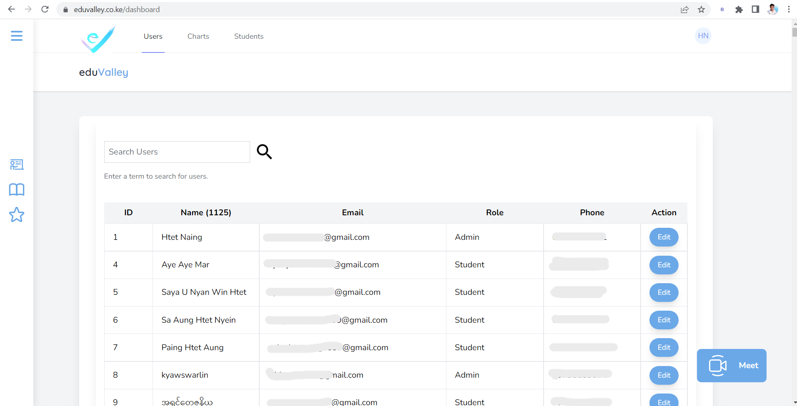

# eduValley

> eduValley is the online learning platform where teachers can upload their educational courses and students can study those courses.
> eduValley also provides FREE UNLIMITED MEETING you can perfoem with all the people you love.
> eduValley is userfriendly and easy to use android application for educational purposes.

## Built With

- Laravel Jetstream
- Jitsimeet

## Screenshots

## Getting Started

To get a local copy up and running:

1. Clone this repository or download the zip folder:

**`git clone https://github.com/rex-9/eduValley-laravel.git`**

2. Navigate to the location of the folder in your machine:

**`you@your-Pc-name:~$ cd eduValley-laravel`**

3. Open the project with VScode:

**`code .`**

4. Build the node packages:

**`npm run build`**

5. Run the server:

**`npm start`**

### FREE UNLIMITED MEETING

You can use FREE UNLIMITED MEETINGS on [eduValley](https://eduvalley.co.ke/meetValley/eduValley). Don't miss to test this out!
You can enter any letters and numbers in RoomID.
Eg 1. `https://eduvalley.co.ke/meetValley/RoomID`
Eg 2. `https://eduvalley.co.ke/meetValley/ThisIsARandomWord`
Eg 3. `https://eduvalley.co.ke/meetValley/092323423422323ThisIsARandomNumber`

You can enter the meeting also using the [eduValley](https://play.google.com/store/apps/details?id=com.eduValley.flutterValley) app built with Flutter

## Rex

👤 - Github: [@rex-9](https://github.com/rex-9/) 
👤 - Medium: [@rex9](https://medium.com/@rex9/) 
👤 - LinkedIn: [@rex9](https://www.linkedin.com/in/rex9/) 
👤 - Angelist: [@rex9](https://angel.co/u/rex9) 
👤 - Facebook: [@htetnaing0814](https://www.facebook.com/htetnaing0814) 
👤 - Twitter: [@htetnaing0814](https://www.twitter.com/htetnaing0814) 

## 🤝 Contributions

Contributions, issues, and feature requests are welcome!

Feel free to check [issue page](https://github.com/rex-9/eduValley-laravel/issues).

## Show your support

Give a ⭐️ if you like this project!

## Acknowledgments

[Microverse](https://bit.ly/MicroverseTN)

Login and Register page design idea by - [SaSa](https://github.com/rex-9/).

Testing by - [Ko Paing](https://github.com/painghtetaung/).

## 📝 License

This project is [Creative Commons](https://creativecommons.org/licenses/by-nc/4.0/) licensed.
